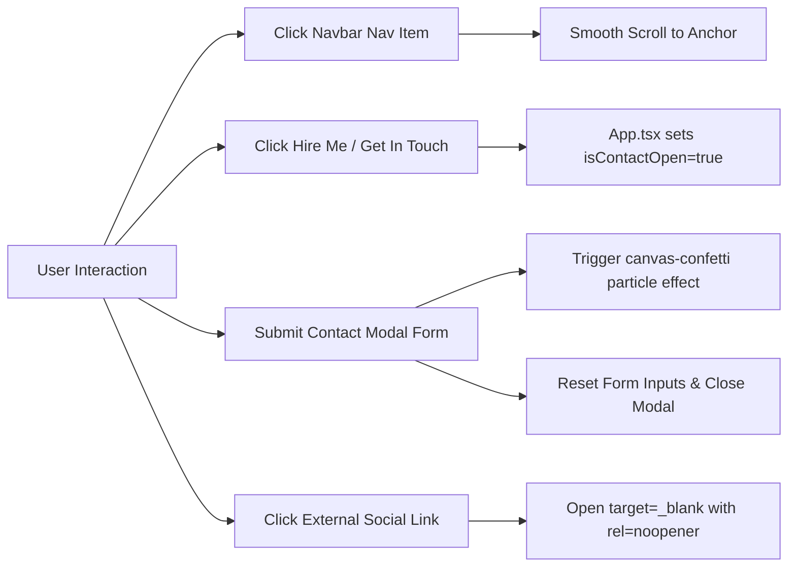

# API & Client Event Graph

```mermaid
graph LR
    User[User Interaction] --> NavClick[Click Navbar Nav Item]
    User --> ContactBtn[Click Hire Me / Get In Touch]
    User --> FormSubmit[Submit Contact Modal Form]
    User --> SocialClick[Click External Social Link]

    NavClick --> Scroll[Smooth Scroll to Anchor]
    ContactBtn --> ModalOpen[App.tsx sets isContactOpen=true]
    FormSubmit --> Confetti[Trigger canvas-confetti particle effect]
    FormSubmit --> Reset[Reset Form Inputs & Close Modal]
    SocialClick --> TabOpen[Open target=_blank with rel=noopener]
```
