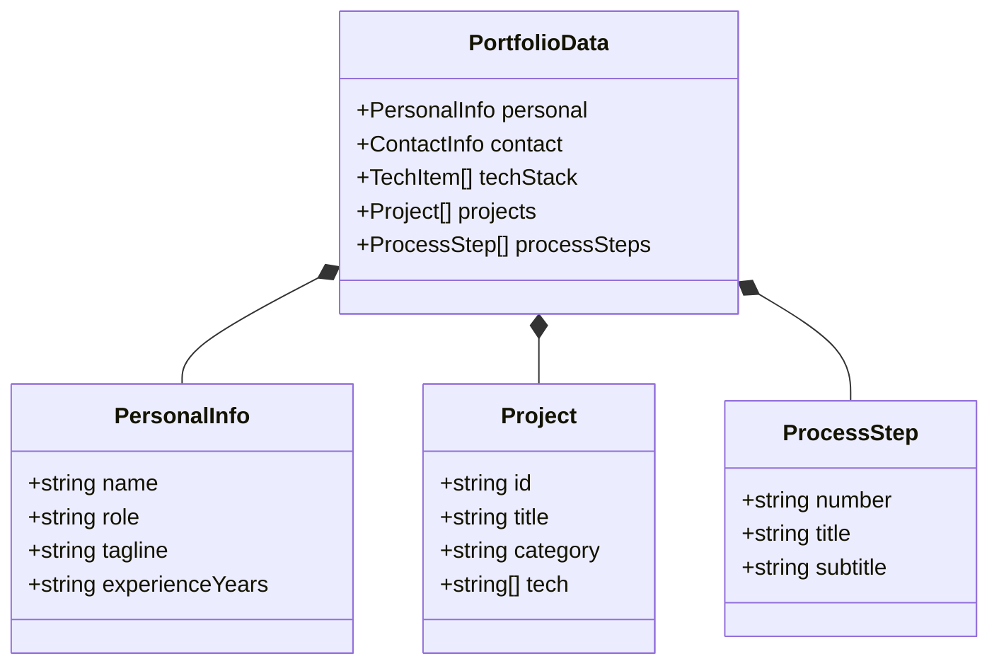

# Database & Data Model Graph

```mermaid
classDiagram
    class PortfolioData {
        +PersonalInfo personal
        +ContactInfo contact
        +TechItem[] techStack
        +Project[] projects
        +ProcessStep[] processSteps
    }
    class PersonalInfo {
        +string name
        +string role
        +string tagline
        +string experienceYears
    }
    class Project {
        +string id
        +string title
        +string category
        +string[] tech
    }
    class ProcessStep {
        +string number
        +string title
        +string subtitle
    }

    PortfolioData *-- PersonalInfo
    PortfolioData *-- Project
    PortfolioData *-- ProcessStep
```
