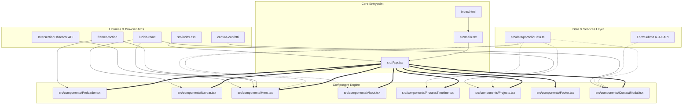

# Codebase System Graph (Auto-Generated)

```mermaid
graph TD
    subgraph Core Entrypoint
        IndexHTML[index.html] --> Main[src/main.tsx]
        Main --> App[src/App.tsx]
    end

    subgraph Component Engine
        App ==> Preloader[src/components/Preloader.tsx]
        App ==> Navbar[src/components/Navbar.tsx]
        App ==> Hero[src/components/Hero.tsx]
        App ==> About[src/components/About.tsx]
        App ==> ProcessTimeline[src/components/ProcessTimeline.tsx]
        App ==> Projects[src/components/Projects.tsx]
        App ==> Footer[src/components/Footer.tsx]
        App ==> ContactModal[src/components/ContactModal.tsx]
    end

    subgraph Data & Services Layer
        Data[src/data/portfolioData.ts] ..-> Hero
        Data ..-> About
        Data ..-> ProcessTimeline
        Data ..-> Projects
        Data ..-> ContactModal
        FormSubmit[FormSubmit AJAX API] ..-> ContactModal
    end

    subgraph Libraries & Browser APIs
        CSS[src/index.css] --> App
        Confetti[canvas-confetti] --> ContactModal
        Motion[framer-motion] --> Preloader
        Motion --> Hero
        Icons[lucide-react] --> Navbar
        Icons --> Hero
        Icons --> Projects
        Obs[IntersectionObserver API] --> Hero
    end
```
