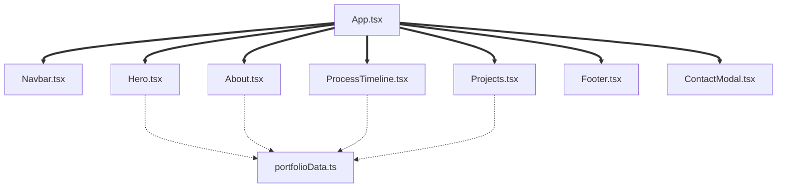

# Visualization Guidelines

All graph visualizations MUST be compatible with GitHub-flavored Markdown Mermaid diagram syntax:

```mermaid
graph TD
    App[App.tsx] ==> Navbar[Navbar.tsx]
    App ==> Hero[Hero.tsx]
    App ==> About[About.tsx]
    App ==> ProcessTimeline[ProcessTimeline.tsx]
    App ==> Projects[Projects.tsx]
    App ==> Footer[Footer.tsx]
    App ==> ContactModal[ContactModal.tsx]

    Hero ..-> Data[portfolioData.ts]
    About ..-> Data
    ProcessTimeline ..-> Data
    Projects ..-> Data
```
